```mermaid
flowchart LR
    T[Teacher creates course] --> U[Upload course material]
    U --> X[Extract text from material]
    X --> L[LLM extracts nodes and relations]
    L --> G[Store and render knowledge graph]
    G --> E[Teacher reviews and edits graph]
    E --> P[Publish course graph]
    P --> S[Student browses graph]
    S --> R[Open related learning resources]
```

# KGC Project Baseline

> Project: AI-powered knowledge graph automatic generation system (KGC / Zhiwei Zhixue)
>
> Purpose: This document is the shared development baseline for the project. Future development conversations should start from this file and update it when scope, status, or decisions change.
>
> Last updated: 2026-07-29

## 1. Current Objective

The immediate objective is to produce a usable, deployable, and demonstrable system prototype that supports the project's completion and software-copyright application. The project is a university innovation project, not a commercial service at this stage.

Development priorities are therefore:

1. Make the main teaching workflow actually work end to end.
2. Deploy the system to a server with persistent data and a public demonstration URL.
3. Complete the core functions promised in the proposal where feasible.
4. Produce stable demonstration materials, technical documents, and evidence for project completion and software copyright registration.

Full commercial-grade security, authorization hardening, attack defense, high availability, and large-scale concurrency are explicitly not goals of this phase. They must not block progress on the prototype.

One operational exception remains: API keys, database passwords, and other credentials must not be kept in committed source code or sent to the browser. This is not a security-hardening project; it prevents direct service abuse and unexpected cost after deployment. Existing exposed credentials must be rotated before deployment.

## 2. Product Definition

KGC is an education-oriented platform that converts course materials into an editable knowledge graph, then uses that graph to organize learning resources and guide student learning.

The system has two layers of value:

1. **Standard workflow functions**: registration, course/resource management, upload, persistence, publishing, and demonstration-oriented student browsing. These functions support the project being usable, deployable, and easy to present.
2. **Core technical functions**: after the LLM extracts structured knowledge from teaching materials, the backend must generate, merge, arrange, and maintain the knowledge graph itself. This includes graph construction quality, node/relationship organization, source traceability, and rendering stability. Current visible issues such as node overlap, layout crowding, and graph display bugs belong to this core technical layer.

The long-term technical direction is to study and borrow from open-source knowledge-graph generation and graph-layout toolchains where useful, then combine them with this project's course-scoped data model and LLM extraction pipeline to improve graph generation quality and display stability.

The intended core flow is:

The target users are teachers, who build and manage courses and graphs, and students, who browse a published graph and learn from attached resources. The AI tutor, learning analytics, multimodal reasoning, and advanced graph inference are extensions, not prerequisites for the first deployable version.

## 3. Current Implementation Status

### 3.1 Implemented backend foundation

- Spring Boot 3.2.3 and Java 17 backend.
- MySQL via Spring Data JPA for users and uploaded-file metadata.
- Neo4j Aura via Spring Data Neo4j for graph nodes and relationships.
- JWT registration and login infrastructure is present.
- Real email-verification registration is working locally: verification codes are persisted in MySQL with TTL, cooldown, and daily limit controls; codes are sent through Spring Mail SMTP; registration validates `emailCode` before creating a user.
- Tencent Cloud SMS sender infrastructure exists behind configuration, but SMS is disabled for the current live flow because Tencent SMS qualification review is still pending.
- File upload service supports files up to 50 MB and stores physical files locally plus metadata in MySQL.
- Text extraction is implemented for PDF, Word (`.doc` / `.docx`), and PowerPoint (`.ppt` / `.pptx`).
- DeepSeek integration requests structured JSON containing `nodes` and `relationships`.
- Parsing route: `POST /api/v1/files/{fileId}/parse`.
- Whole-graph route: `GET /api/v1/graph/all` (backward-compatible).
- Course-scoped graph route: `GET /api/v1/courses/{courseId}/graph` returns only the nodes and relationships belonging to a specific course.
- Knowledge graph nodes are now stored with a `courseId` property in Neo4j, enabling course-level isolation. Node deduplication is scoped per course (`findByNameAndCourseId`), and relationship Cypher queries include `courseId` constraints to prevent cross-course linking.
- Graph API identifiers are now unified: both `NodeDTO.id` and `LinkDTO.source/target` use the Neo4j database ID consistently. `LinkDTO` also includes the relationship's Neo4j ID for editing and deletion.
- Full graph CRUD APIs are implemented: `POST/PUT/DELETE /api/v1/courses/{courseId}/graph/nodes/{nodeId}` for node management, `POST/PUT/DELETE /api/v1/courses/{courseId}/graph/relationships/{relId}` for relationship management. All operations enforce course-level ownership and include duplicate-name checks and relationship-type validation.
- The parsing pipeline returns the LLM JSON even if Neo4j persistence fails, so the front end can render the immediate result.

The target users are teachers, who build and manage courses and graphs, and students, who browse a published graph and learn from attached resources. The AI tutor, learning analytics, multimodal reasoning, and advanced graph inference are extensions, not prerequisites for the first deployable version.

## 3. Current Implementation Status

### 3.1 Implemented backend foundation

- Spring Boot 3.2.3 and Java 17 backend.
- MySQL via Spring Data JPA for users and uploaded-file metadata.
- Neo4j Aura via Spring Data Neo4j for graph nodes and relationships.
- JWT registration and login infrastructure is present.
- Real email-verification registration is working locally: verification codes are persisted in MySQL with TTL, cooldown, and daily limit controls; codes are sent through Spring Mail SMTP; registration validates `emailCode` before creating a user.
- Tencent Cloud SMS sender infrastructure exists behind configuration, but SMS is disabled for the current live flow because Tencent SMS qualification review is still pending.
- File upload service supports files up to 50 MB and stores physical files locally plus metadata in MySQL.
- Text extraction is implemented for PDF, Word (`.doc` / `.docx`), and PowerPoint (`.ppt` / `.pptx`).
- DeepSeek integration requests structured JSON containing `nodes` and `relationships`.
- Parsing route: `POST /api/v1/files/{fileId}/parse`.
- Whole-graph route: `GET /api/v1/graph/all` (backward-compatible).
- Course-scoped graph route: `GET /api/v1/courses/{courseId}/graph` returns only the nodes and relationships belonging to a specific course.
- Knowledge graph nodes are now stored with a `courseId` property in Neo4j, enabling course-level isolation. Node deduplication is scoped per course (`findByNameAndCourseId`), and relationship Cypher queries include `courseId` constraints to prevent cross-course linking.
- Graph API identifiers are now unified: both `NodeDTO.id` and `LinkDTO.source/target` use the Neo4j database ID consistently. `LinkDTO` also includes the relationship's Neo4j ID for editing and deletion.
- Full graph CRUD APIs are implemented: `POST/PUT/DELETE /api/v1/courses/{courseId}/graph/nodes/{nodeId}` for node management, `POST/PUT/DELETE /api/v1/courses/{courseId}/graph/relationships/{relId}` for relationship management. All operations enforce course-level ownership and include duplicate-name checks and relationship-type validation.
- The parsing pipeline returns the LLM JSON even if Neo4j persistence fails, so the front end can render the immediate result.

### 3.2 Implemented frontend demonstration

- Teacher-oriented dashboard, course, resource, graph-generation, and settings pages exist as static HTML pages.
- The graph-generation page can upload a file, call the parsing API, render an ECharts tree graph. The page now reads `courseId` from the URL parameter and loads existing graph data from the backend API on page load, replacing the previous `localStorage`-based persistence.
- The graph page now includes a full interactive editing UI: a toolbar with "Add Node", "Add Relationship" (link mode), and "Refresh" buttons; a right-click context menu on nodes for rename, add child node with auto-linking, and delete (with confirmation); modal dialogs for all editing operations; and a link-mode state machine for creating arbitrary relationships between two nodes. All operations call the backend CRUD APIs and auto-refresh the graph on success.
- Student-oriented learning pages and an AI tutor demonstration exist. `student_courses.html` now dynamically fetches published courses from the backend, and a dedicated `student_graph.html` provides a clean, read-only graph browsing experience, allowing students to navigate the knowledge graph and click nodes to access specific learning resources.
- The current graph renderer uses ECharts tree layout with orthogonal polyline edges and expand/collapse interaction.
- Static `register.html` and `login.html` now call the real authentication APIs. Registration currently exposes the email-verification flow only; SMS verification UI is intentionally hidden until SMS provider approval is available.
- Course persistence has started: the backend now has a real `Course` entity (with a `published` status flag), repository, service, and `/api/v1/courses` CRUD-style API. The teacher course page now loads and creates courses through the backend API, and features a one-click Publish/Unpublish toggle.
- Resource listing has a backend course filter path through `GET /api/v1/files?courseId={id}`, while the resource-management page still needs to be connected fully to the backend upload/listing flow.

### 3.3 What is still a demonstration or incomplete

- Learning progress and some cross-page state are still static data or `localStorage`; they are not yet a complete backend business system.
- Course persistence exists, but the teacher-to-course-to-resource ownership model is still lightweight and not yet a complete permission system.
- Graph CRUD backend APIs and frontend interactive editing UI are now both complete, as well as course publishing controls and student-facing graph browsing.
- Parsing is synchronous and sends the complete extracted text to the LLM. Large documents can exceed model input limits and need chunking plus result merging.
- Graph visualization still has practical defects such as overlap, crowding, and layout instability, so the rendering and graph-arrangement layer still needs targeted improvement.
- Excel, scanned-document OCR, image understanding, audio transcription, video processing, conflict detection, reinforcement feedback, and advanced inference are not currently implemented.
- The source inspected does not contain the progress-document's "ghost anchor" layout algorithm. The current implementation should be described truthfully as ECharts tree rendering and interaction until that algorithm is implemented.

## 4. MVP Scope for Completion

The first deployable version is considered complete when the following workflow is reliable:

1. A teacher can register or use a simple demonstration account.
2. A teacher can create a course and upload PDF, Word, or PowerPoint materials into that course.
3. The system extracts material text, calls the LLM, and creates a course-scoped graph.
4. The teacher can view, add, edit, and delete graph nodes and relationships, then save the result.
5. The teacher can publish a course graph.
6. A student can enter or select a published course, browse its graph, expand nodes, and open resources associated with knowledge nodes.
7. The system runs from a server URL with MySQL persistence, Neo4j connectivity, file storage, and a repeatable deployment procedure.

The MVP does not require a full permission system. A lightweight teacher/student distinction or predefined demonstration accounts are sufficient for acceptance. The priority is a coherent product workflow, not commercial account isolation.

## 5. Development Roadmap

### Phase 0: Deployment baseline and configuration

Goal: Make the existing application deployable without changing the user-facing scope.

- Move runtime credentials and connection settings to environment variables or a server-only configuration file.
- Rotate currently exposed credentials before deployment.
- Define the initial deployment topology: Spring Boot application, MySQL, existing Neo4j Aura, persistent upload directory, and Nginx reverse proxy if needed.
- Add a concise server deployment and restart guide.
- Verify that the packaged application starts with the deployed configuration.

Acceptance: A server can start the backend, connect to MySQL and Neo4j, serve the static front end, and accept a test upload.

### Phase 1: Course and resource business backbone

Goal: Replace fake course and resource state with persistent backend data.

- Add Course entity, repository, service, and basic CRUD API.
- Associate courses with an owner where practical; do not let authorization complexity delay the main workflow.
- Associate ResourceFile with a real Course entity rather than only a numeric `courseId`.
- Add list, detail, and delete APIs for course resources.
- Connect course and resource pages to these APIs, replacing the main `localStorage` data path.

Acceptance: A created course and its uploaded resources survive browser refresh and server restart.

### Phase 2: Reliable course-scoped graph generation

Goal: Make graph generation an auditable and repeatable course feature.

- Define a stable graph data model: graph, node, relationship, source resource, course, and publication status.
- Scope graph nodes and relationships by course and source material; prevent same-name concepts in unrelated courses from being merged accidentally.
- Normalize graph API identifiers so node IDs and link source/target values use one consistent convention.
- Add text chunking, per-chunk extraction, de-duplication, and graph merging for long documents.
- Persist parsing status and errors so the interface can distinguish pending, successful, and failed parsing.
- Preserve the raw LLM response or processing record for debugging and project evidence.

Acceptance: A teacher can upload a long enough real course document, obtain a stable course graph, refresh the page, and retrieve the same graph from the backend.

### Phase 3: Graph editing, publishing, and visual integration (COMPLETED)

Goal: Deliver the proposal's central teacher experience.

- Add node and relationship CRUD APIs.
- Connect the graph page to persisted course graph data rather than only immediate parsing output.
- Support node add, rename, delete, relationship add, relationship edit, and relationship delete.
- Save teacher edits and show resource links on relevant nodes.
- Add a publish/unpublish action.
- Keep ECharts tree mode as the first stable renderer; add network or other views only after the tree workflow is reliable.

Acceptance: A teacher can generate, correct, save, publish, and reopen a graph without losing work. (Verified)

### Phase 4: Student learning workflow (COMPLETED)

Goal: Turn the graph into a usable learning entry point.

- Add a student course list and published-course view.
- Render the published graph in a read-only student mode.
- Allow graph nodes to link to course resources.
- Record only simple learning evidence if time permits: opened nodes, opened resources, or completion status.
- Route AI tutor requests through the backend. The browser must not call the model provider with a secret key.

Acceptance: A student can follow a graph node to learning material and complete a coherent demonstration flow. (Verified)

### Phase 5: Deployment, verification, and project evidence

Goal: Prepare a stable version for completion and software copyright registration.

- Deploy the final prototype to the server and verify the end-to-end workflow with real sample teaching material.
- Create test accounts or a deterministic demo dataset.
- Record a demonstration video covering the teacher and student workflows.
- Update the project design document, deployment guide, API list, and user manual to match the actual implementation.
- Prepare screenshots, test records, and a source-code archive for the software-copyright application and project completion materials.

Acceptance: The project can be demonstrated from a server URL without relying on local mock data or manual database intervention.

## 6. Deferred Research Functions

The following functions remain valid long-term directions from the proposal, but are not blockers for the MVP:

- OCR for scanned PDFs, figures, formulas, and screenshots.
- Excel and richer multimodal parsing.
- Audio transcription, video key-frame extraction, and vision-language fusion.
- Subject-specific prompt templates and prompt A/B evaluation.
- Confidence scoring, multi-source verification, and conflict detection.
- Entity disambiguation, ontology alignment, implicit-relation mining, and inference completion.
- Teacher-feedback learning, reinforcement learning, and model fine-tuning.
- Advanced visualization modes, including a verified anti-layout-shift algorithm.
- Learning analytics, question-bank linkage, and personalized recommendation.

These should be added only when they directly strengthen the completion demonstration or when the prerequisite MVP workflow is already stable.

## 7. Engineering Decisions for This Phase

- No graph databases other than Neo4j will be introduced; Aura is acceptable.
- MySQL remains the primary relational store.
- The React/Vue migration is cancelled for this prototype; vanilla JS and HTML will be enhanced directly to save time.
- ECharts is confirmed as the graphing library. D3 or specialized libraries will only be used if ECharts structurally fails to render the specific "ghost anchor" algorithm.
