# KGC Project Baseline

> Project: AI-powered knowledge graph automatic generation system (KGC / Zhiwei Zhixue)
>
> Purpose: This document is the shared development baseline for the project. Future development conversations should start from this file and update it when scope, status, or decisions change.
>
> Last updated: 2026-07-25

## 1. Current Objective

The immediate objective is to produce a usable, deployable, and demonstrable system prototype that supports the project's completion and software-copyright application. The project is a university innovation project, not a commercial service at this stage.

Development priorities are therefore:

1. Make the main teaching workflow actually work end to end.
2. Deploy the system to a server with persistent data and a public demonstration URL.
3. Complete the core functions promised in the proposal where feasible.
4. Produce stable demonstration materials, technical documents, and evidence for project completion and software copyright registration.

Full commercial-grade security, authorization hardening, attack defense, high availability, and large-scale concurrency are explicitly not goals of this phase. They must not block progress on the prototype.

One operational exception remains: API keys, database passwords, and other credentials must not be kept in committed source code or sent to the browser. This is not a security-hardening project; it prevents direct service abuse and unexpected cost after deployment. Existing exposed credentials must be rotated before deployment.

## 2. Product Definition

KGC is an education-oriented platform that converts course materials into an editable knowledge graph, then uses that graph to organize learning resources and guide student learning.

The intended core flow is:

The target users are teachers, who build and manage courses and graphs, and students, who browse a published graph and learn from attached resources. The AI tutor, learning analytics, multimodal reasoning, and advanced graph inference are extensions, not prerequisites for the first deployable version.

## 3. Current Implementation Status

### 3.1 Implemented backend foundation

- Spring Boot 3.2.3 and Java 17 backend.
- MySQL via Spring Data JPA for users and uploaded-file metadata.
- Neo4j Aura via Spring Data Neo4j for graph nodes and relationships.
- JWT registration and login infrastructure is present.
- Real email-verification registration is working locally: verification codes are persisted in MySQL with TTL, cooldown, and daily limit controls; codes are sent through Spring Mail SMTP; registration validates `emailCode` before creating a user.
- Tencent Cloud SMS sender infrastructure exists behind configuration, but SMS is disabled for the current live flow because Tencent SMS qualification review is still pending.
- File upload service supports files up to 50 MB and stores physical files locally plus metadata in MySQL.
- Text extraction is implemented for PDF, Word (`.doc` / `.docx`), and PowerPoint (`.ppt` / `.pptx`).
- DeepSeek integration requests structured JSON containing `nodes` and `relationships`.
- Parsing route: `POST /api/v1/files/{fileId}/parse`.
- Whole-graph route: `GET /api/v1/graph/all`.
- The parsing pipeline returns the LLM JSON even if Neo4j persistence fails, so the front end can render the immediate result.

```mermaid
flowchart LR
    T[Teacher creates course] --> U[Upload course material]
    U --> X[Extract text from material]
    X --> L[LLM extracts nodes and relations]
    L --> G[Store and render knowledge graph]
    G --> E[Teacher reviews and edits graph]
    E --> P[Publish course graph]
    P --> S[Student browses graph]
    S --> R[Open related learning resources]
```

### 3.2 Implemented frontend demonstration

- Teacher-oriented dashboard, course, resource, graph-generation, and settings pages exist as static HTML pages.
- The graph-generation page can upload a file, call the parsing API, render an ECharts tree graph, and preserve the rendered result in browser `localStorage`.
- Student-oriented learning pages and an AI tutor demonstration exist.
- The current graph renderer uses ECharts tree layout with orthogonal polyline edges and expand/collapse interaction.
- Static `register.html` and `login.html` now call the real authentication APIs. Registration currently exposes the email-verification flow only; SMS verification UI is intentionally hidden until SMS provider approval is available.

### 3.3 What is still a demonstration or incomplete

- Courses, resources, learning progress, and most cross-page state are primarily static data or `localStorage`; they are not yet a complete backend business system.
- There is no actual Course entity or teacher-to-course-to-resource ownership model in the backend.
- Graph retrieval is global rather than scoped cleanly to a course or a source file.
- The current graph DTO uses node database IDs while links use node names, which needs normalization before production-style rendering.
- Repeated node names can be merged across unrelated source files because persistence looks up nodes by name globally.
- Graph editing is a frontend expectation from the proposal, but persistent node and relationship CRUD is not yet implemented.
- Parsing is synchronous and sends the complete extracted text to the LLM. Large documents can exceed model input limits and need chunking plus result merging.
- Excel, scanned-document OCR, image understanding, audio transcription, video processing, conflict detection, reinforcement feedback, and advanced inference are not currently implemented.
- The source inspected does not contain the progress-document's "ghost anchor" layout algorithm. The current implementation should be described truthfully as ECharts tree rendering and interaction until that algorithm is implemented.

## 4. MVP Scope for Completion

The first deployable version is considered complete when the following workflow is reliable:

1. A teacher can register or use a simple demonstration account.
2. A teacher can create a course and upload PDF, Word, or PowerPoint materials into that course.
3. The system extracts material text, calls the LLM, and creates a course-scoped graph.
4. The teacher can view, add, edit, and delete graph nodes and relationships, then save the result.
5. The teacher can publish a course graph.
6. A student can enter or select a published course, browse its graph, expand nodes, and open resources associated with knowledge nodes.
7. The system runs from a server URL with MySQL persistence, Neo4j connectivity, file storage, and a repeatable deployment procedure.

The MVP does not require a full permission system. A lightweight teacher/student distinction or predefined demonstration accounts are sufficient for acceptance. The priority is a coherent product workflow, not commercial account isolation.

## 5. Development Roadmap

### Phase 0: Deployment baseline and configuration

Goal: Make the existing application deployable without changing the user-facing scope.

- Move runtime credentials and connection settings to environment variables or a server-only configuration file.
- Rotate currently exposed credentials before deployment.
- Define the initial deployment topology: Spring Boot application, MySQL, existing Neo4j Aura, persistent upload directory, and Nginx reverse proxy if needed.
- Add a concise server deployment and restart guide.
- Verify that the packaged application starts with the deployed configuration.

Acceptance: A server can start the backend, connect to MySQL and Neo4j, serve the static front end, and accept a test upload.

### Phase 1: Course and resource business backbone

Goal: Replace fake course and resource state with persistent backend data.

- Add Course entity, repository, service, and basic CRUD API.
- Associate courses with an owner where practical; do not let authorization complexity delay the main workflow.
- Associate ResourceFile with a real Course entity rather than only a numeric `courseId`.
- Add list, detail, and delete APIs for course resources.
- Connect course and resource pages to these APIs, replacing the main `localStorage` data path.

Acceptance: A created course and its uploaded resources survive browser refresh and server restart.

### Phase 2: Reliable course-scoped graph generation

Goal: Make graph generation an auditable and repeatable course feature.

- Define a stable graph data model: graph, node, relationship, source resource, course, and publication status.
- Scope graph nodes and relationships by course and source material; prevent same-name concepts in unrelated courses from being merged accidentally.
- Normalize graph API identifiers so node IDs and link source/target values use one consistent convention.
- Add text chunking, per-chunk extraction, de-duplication, and graph merging for long documents.
- Persist parsing status and errors so the interface can distinguish pending, successful, and failed parsing.
- Preserve the raw LLM response or processing record for debugging and project evidence.

Acceptance: A teacher can upload a long enough real course document, obtain a stable course graph, refresh the page, and retrieve the same graph from the backend.

### Phase 3: Graph editing, publishing, and visual integration

Goal: Deliver the proposal's central teacher experience.

- Add node and relationship CRUD APIs.
- Connect the graph page to persisted course graph data rather than only immediate parsing output.
- Support node add, rename, delete, relationship add, relationship edit, and relationship delete.
- Save teacher edits and show resource links on relevant nodes.
- Add a publish/unpublish action.
- Keep ECharts tree mode as the first stable renderer; add network or other views only after the tree workflow is reliable.

Acceptance: A teacher can generate, correct, save, publish, and reopen a graph without losing work.

### Phase 4: Student learning workflow

Goal: Turn the graph into a usable learning entry point.

- Add a student course list and published-course view.
- Render the published graph in a read-only student mode.
- Allow graph nodes to link to course resources.
- Record only simple learning evidence if time permits: opened nodes, opened resources, or completion status.
- Route AI tutor requests through the backend. The browser must not call the model provider with a secret key.

Acceptance: A student can follow a graph node to learning material and complete a coherent demonstration flow.

### Phase 5: Deployment, verification, and project evidence

Goal: Prepare a stable version for completion and software copyright registration.

- Deploy the final prototype to the server and verify the end-to-end workflow with real sample teaching material.
- Create test accounts or a deterministic demo dataset.
- Record a demonstration video covering the teacher and student workflows.
- Update the project design document, deployment guide, API list, and user manual to match the actual implementation.
- Prepare screenshots, test records, and a source-code archive for the software-copyright application and project completion materials.

Acceptance: The project can be demonstrated from a server URL without relying on local mock data or manual database intervention.

## 6. Deferred Research Functions

The following functions remain valid long-term directions from the proposal, but are not blockers for the MVP:

- OCR for scanned PDFs, figures, formulas, and screenshots.
- Excel and richer multimodal parsing.
- Audio transcription, video key-frame extraction, and vision-language fusion.
- Subject-specific prompt templates and prompt A/B evaluation.
- Confidence scoring, multi-source verification, and conflict detection.
- Entity disambiguation, ontology alignment, implicit-relation mining, and inference completion.
- Teacher-feedback learning, reinforcement learning, and model fine-tuning.
- Advanced visualization modes, including a verified anti-layout-shift algorithm.
- Learning analytics, question-bank linkage, and personalized recommendation.

These should be added only when they directly strengthen the completion demonstration or when the prerequisite MVP workflow is already stable.

## 7. Engineering Decisions for This Phase

| Topic | Current decision |
| --- | --- |
| Product focus | Educational knowledge-graph workflow, not a generic graph platform |
| Frontend | Keep the existing static HTML/ECharts implementation initially; do not migrate to Vue solely for architectural purity |
| Backend | Continue with Spring Boot, MySQL, Neo4j Aura, and DeepSeek integration |
| Graph view | Tree view is the primary stable view; other views are optional |
| Material formats | PDF, Word, and PowerPoint first; other formats are later |
| AI pipeline | DeepSeek structured JSON with robust validation, chunking, and merging |
| Data model | Course-scoped and source-traceable graphs are required |
| Security scope | No commercial-grade security work, but credentials leave the repository/browser before deployment |
| Deployment | One server prototype with persistent storage is sufficient |
| Quality bar | A real, repeatable end-to-end workflow is more valuable than a broad but static feature list |

### 7.1 Current Local Database Baseline

This section records the verified local development environment as of 2026-07-21. It is a development-only baseline, not a server deployment configuration.

| Item | Current verified value |
| --- | --- |
| Database service | XAMPP MariaDB 10.4.32 |
| Host and port | `127.0.0.1:3306` |
| Database name | `kgc_db` |
| Database user | `root` |
| Database password | No password is currently set. `KGC_DB_PASSWORD` therefore uses its empty default locally. |
| Application datasource overrides | `KGC_DB_URL`, `KGC_DB_USERNAME`, and `KGC_DB_PASSWORD` may override the local defaults for another environment. |
| Schema handling | Hibernate `spring.jpa.hibernate.ddl-auto=update` creates or updates mapped tables at startup. |
| Verified result | The backend started successfully, the schema was available, and a `test1` user was registered successfully. |

For a future server deployment, set a non-empty database password and provide it through the server environment rather than changing the source file.

### 7.2 Current Local Email Verification Baseline

This section records the verified local email-verification state as of 2026-07-25. It is a development-only baseline.

| Item | Current verified value |
| --- | --- |
| Live verification channel | Email only |
| Mail provider used for local verification | QQ SMTP |
| SMTP runtime configuration | Local runtime may use environment variables (`KGC_MAIL_*`) or the ignored root-level `application-local.properties` imported by `spring.config.import=optional:file:./application-local.properties`. |
| Secret-handling rule | SMTP authorization code must stay in local ignored config or environment variables. Do not commit it. |
| Test profile | `src/test/resources/application-test.properties` provides mock mail properties for Spring tests. |
| Verified result | A real email verification code was sent, and registration/login succeeded locally through the browser. |
| Known account rule | One email address currently maps to one account. Trying to register the same email for a second role should surface a clear “email already registered” style error rather than a frontend response-stream exception. |

### 7.3 Version Control and Collaboration Baseline

This section records the verified code-management baseline as of 2026-07-24.

| Item | Current verified value |
| --- | --- |
| Local VCS | Git repository initialized successfully in `F:\KGC`. |
| Main branch | `main` |
| Initial baseline commit | `9e953f4 chore: establish project baseline` |
| Initial committed scope | 91 key project files, including the Spring Boot backend, static frontend demo, baseline/design documents, dependency files, and project support files selected for source collaboration. |
| GitHub account | `Yujin-Wu-xtu` |
| GitHub repository | `https://github.com/Yujin-Wu-xtu/KGC` |
| Remote tracking | Local `main` is connected to `origin/main`. |
| GitHub tooling | GitHub CLI (`gh`) installed and authenticated through browser Device Code authorization. |
| Push/auth strategy | Use HTTPS plus the `gh` credential helper path. This avoids the Windows Chinese-user-path SSH key issue observed under `C:\Users\吴育锦`. |
| Repository visibility | Public GitHub repository. Avoid committing credentials, private deployment configuration, large generated packages, and transient local runtime files. |

The incorrect temporary GitHub username spelling `Yvjin` has been corrected to the actual account `Yujin-Wu-xtu`.

Future collaboration should use Git as the default checkpoint mechanism. Keep `main` demonstrable and reasonably stable. For larger milestones, create short-lived feature branches such as `phase-1-course-resource-backbone`, commit coherent changes with clear messages, then merge back after verification.

## 8. Working Rules for Future Development Conversations

1. Start from this document and identify the active roadmap phase.
2. Prefer the smallest change that advances the current phase's acceptance criteria.
3. Mark implementation claims as either implemented, demonstration-only, or planned. Do not present planned research functions as delivered features.
4. Update this file whenever an architectural decision, roadmap item, acceptance criterion, or implementation status changes materially.
5. Before moving to a later phase, verify the current phase with a real end-to-end workflow.
6. Keep the system demoable at all times. Avoid large refactors that temporarily break the existing presentation unless they are necessary for the active milestone.
7. Use Git commits as project checkpoints. Before substantial edits, inspect `git status`; after a coherent change, verify behavior and commit with a clear message.
8. Continue using HTTPS plus `gh` authentication for GitHub operations unless the Windows SSH key path issue is deliberately reconfigured later.
9. Future conversations, design notes, and implementation plans should default to Chinese unless an English term is needed for code, APIs, or citations.

## 9. Immediate Next Step

The recommended next milestone is **finish Phase 0 cleanup, then start Phase 1 course/resource persistence**:

1. Finish Phase 0 configuration cleanup: confirm `application-local.properties` usage, document local/server startup, and rotate any credentials that may have appeared in historical local files before deployment.
2. Start Phase 1: add persistent Course entity/repository/service/API and connect course listing/detail pages to backend data instead of `localStorage`.
3. Attach uploaded ResourceFile records to real courses, then make graph generation course-scoped.
4. Keep the verified email-registration flow stable while course/resource work proceeds.

This ordering prevents later graph and student-learning work from being built on temporary `localStorage` state.

## 10. Change Log

| Date | Change |
| --- | --- |
| 2026-07-21 | Created the shared project baseline from the original proposal, backend progress document, and current source review. |
| 2026-07-21 | Added email and mobile-number registration plus username/email/mobile login. Added the deployable `register.html` page and replaced the login page's mock redirect with real authentication API calls. Verification-code delivery was deferred at that time because no email/SMS provider had been selected. |
| 2026-07-21 | Configured the local-default `kgc_db` datasource to read URL/username/password from `KGC_DB_URL`/`KGC_DB_USERNAME`/`KGC_DB_PASSWORD` with local defaults, and enabled Hibernate `ddl-auto=update` automatic schema synchronization. |
| 2026-07-21 | Verified the local XAMPP MariaDB integration: the backend started against `kgc_db`, Hibernate initialized the schema, and registration of the `test1` user succeeded. Documented the current passwordless local development database baseline. |
| 2026-07-24 | Established the Git/GitHub collaboration baseline: initialized the local Git repository, set `main` as the primary branch, committed 91 key files as baseline commit `9e953f4`, installed and authenticated GitHub CLI, created and pushed to `https://github.com/Yujin-Wu-xtu/KGC`, corrected the temporary username typo from `Yvjin` to `Yujin`, and selected HTTPS plus `gh` credential helper as the stable push strategy. |
| 2026-07-25 | Added and verified the real email registration verification-code flow: MySQL-backed verification-code records with TTL, cooldown, and daily limit; Spring Mail SMTP sender; Tencent Cloud SMS sender scaffold kept disabled; `/api/v1/auth/verification-code/send` and `/verify` APIs; email-only registration UI; local `application-local.properties` support for ignored SMTP config; JSON auth error responses; and frontend response parsing that no longer reads a fetch body twice. A real browser registration/login with email code was manually verified locally. |
